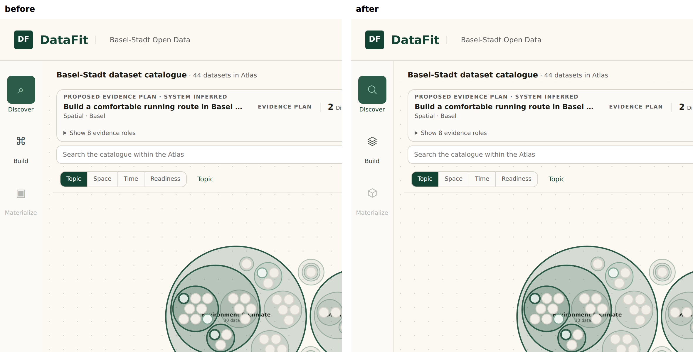

# pikto apply

`pikto apply <repo> --profile P [--decision F] [--dry-run]` turns the human's pick from the [contact sheet](SHEET.md) into a reviewable diff:

1. **Icons module.** `src/ui/icons.ts` exports `icon(name, size)`, which returns a plain SVG string. The module has no framework and no dependency, and colour comes from `currentColor`, so existing state classes keep working. Every icon is adapted and validated first. If any one fails, nothing is written.
2. **Call sites.** A small lexer decides the context of every glyph:
   - in template text, the glyph becomes `${icon('x', 18)}`
   - in a string literal that is only the glyph, the literal becomes `icon('x')`
   - in a longer string, the string is split into `'…' + icon('x') + '…'`
   - in code or comments, the glyph is never touched
   
   If the file already declares its own `icon`, the import is aliased (`icon as iconSvg`). ASCII glyphs (`?`, `+`) are replaced only at explicit `file:line` sites, and only when they stand alone between `>`/`<` or quotes. Sites that no rule covers come back as `unmapped`: those are for the agent to edit by hand.
3. **Provenance.** `.pikto/provenance.json` records the source, license, set version, operations, and the *reading* and *permission* for each icon.
4. **Drift allow-list.** `.pikto/audit.json` lists the sites deliberately left as text, each with a reason. After that, `pikto audit <repo> --check` exits 1 on any new icon glyph, so it can run in pre-commit or CI.
5. **DESIGN.md.** An `## Iconography` section is appended when it doesn't exist yet. It's the new written intent, and the next `audit` reads it.

## Decision format
```json
{ "module": "src/ui/icons.ts",
  "icons":   { "confirmed": { "source": "ph:check-circle", "meaning": "…", "reading": "…", "permission": "…" } },
  "replace": [ { "glyph": "✓", "icon": "confirmed", "size": 14, "at": ["src/main.ts:364"] } ],
  "skip":    [ { "at": "src/ui/graph.ts:46", "glyph": "✓", "reason": "SVG <text> via d3 .text()" } ],
  "design_md": { "rules": ["…"] } }
```
Rules without `at` apply to every site `audit` classified as an icon. Use `at` when one glyph carries several meanings (△ was both *partial* and *available*).

## First run: opendata-explorer
Decision: [decision-opendata-explorer.json](decision-opendata-explorer.json). Landed as [blackmath88/opendata-explorer#11](https://github.com/blackmath88/opendata-explorer/pull/11), re-run from scratch with v0.5: the audit now classifies the 3 prose arrows as typography itself, so the decision only skips the D3 `<text>` ✓. The original patch is kept as [opendata-explorer-icons.patch](opendata-explorer-icons.patch).

Decisions taken from the sheet's open questions:
- **Build → `ph:stack`**: layers of evidence. Blueprint was too busy at 18px.
- **Partial → `ph:circle-half`**: the states behind it are `locally_weak` and the claim `partial`.
- **Available → `ph:circle-dashed`**, a separate state from partial. The sheet's "faint" flag is partly a measurement artifact: dash ends add perimeter, so the estimate reads thin, while the drawn stroke is the same Phosphor weight. The lower ink suits "there, but not taken up".
- **`+` → `ph:plus-circle`**, so proposed and candidate states join the circle family.

Result:
- **20 sites replaced automatically.** One site, the coverage column in `panels.ts`, was restructured by hand because it ran the glyph through `escapeHtml`.
- **4 sites left as text, with reasons:** two date-range arrows, a ↔ in a sentence, and a ✓ inside a D3 SVG `<text>`.
- **Checks:** `tsc --noEmit` clean, 189/189 tests pass, `audit --check` shows no drift.



## Limits
- The lexer doesn't understand regex literals or JSX text. Framework templates (`.vue`, `.svelte`, `.astro`) need their own write target.
- Replacing a glyph inside something that escapes HTML, or inside an SVG `<text>`, produces the wrong output even when it typechecks. `apply` can't see that, so those sites belong in `skip` or get a hand edit (this is the *reading* step).
