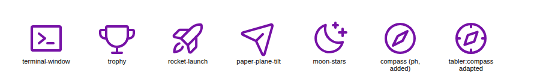
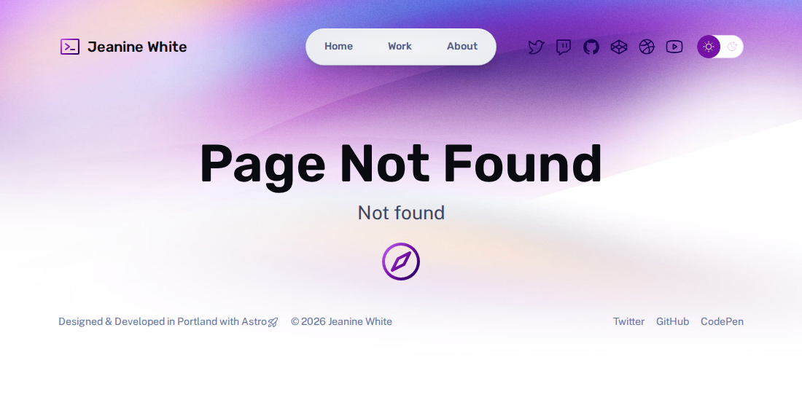

# EXAMPLE — running pikto on a real repo

The project repo was empty, so the target is a real open-source repo: the official **Astro portfolio template** ([withastro/astro › examples/portfolio](https://github.com/withastro/astro/tree/main/examples/portfolio), MIT), copied to `examples/astro-portfolio/`. It suits the test because it already has its own icon system: `IconPaths.ts` contains 24 Phosphor-derived fragments, and a comment explains how to hand-convert new ones.

## 1. Inferred profile (`pikto profile`)

```json
{
  "families": ["ph"],                       // from "Icons adapted from https://phosphoricons.com/"
  "registry": { "file": "src/components/IconPaths.ts", "export": "iconPaths", "count": 24 },
  "component": { "file": "src/components/Icon.astro", "grid": 256 },
  "grid": 256, "stroke_width": 16, "stroke_ratio": 0.0625, "stroke_width_at_24": 1.5,
  "linecap": "round", "linejoin": "round",
  "construction": { "stroke_shapes": 44, "fill_shapes": 13, "dominant": "stroke" },
  "fill_convention": "fill shapes carry stroke=\"none\"; stroke shapes carry fill=\"none\"; colour inherited from <svg>",
  "render_sizes": ["1.2em", "1.6em", "2.5rem", "1.33em"],
  "tokens.accent": { "accent-regular": "#7611a6", "gradient-stop-1": "var(--accent-light)", ... }
}
```
Full file: `examples/astro-portfolio/.pikto/profile.json`.

## 2. UI location (LLM decision)

I checked every page. The home page, nav, footer, CTA and skills already have icons, and each one is used deliberately. About-page section titles don't need icons; adding them would be decoration for its own sake. **`404.astro`** is the one real gap. It is a bare "Page Not Found / Not found" hero with nothing marking it as a distinct state. The site already uses large gradient icons as section markers (`Skills.astro`: `size="2.5rem" gradient`), so a single gradient marker is consistent with existing usage.

## 3. Concept (LLM decision)

"Lost / wrong turn". I considered `compass`, `signpost`, `map-trifold` and `ghost`. I chose **compass** because it means "find your way", doesn't need text to read at 4rem, and a ghost would be too cute for this site.

## 4. Candidates (`pikto search compass`)

| rank | id | set / license | construction | score | why |
|---|---|---|---|---|---|
| 1 | `ph:compass` | Phosphor 2.1.1 / MIT | fill (flattened) | 65 | +50 same family, +5 fill accepted by repo convention, +10 exact name |
| 2 | `ph:compass-rose` | Phosphor / MIT | fill | 55 | same family |
| 4 | `iconoir:compass` | Iconoir / MIT | stroke 1.5@24 | 45 | +15 construction, +20 stroke ratio 0.0625 = 0.0625, +10 name |
| … | `mage:`, `hugeicons:`, `mynaui:` | MIT / Apache | stroke | 45 | same |

**Choice: `ph:compass`.** It is the same family, so the needle shape and ring proportions match `trophy`, `rocket-launch` and the others exactly. Its drawback is fill construction, while most of the registry uses strokes. The repo's own comment explicitly allows this ("Replace any fill with stroke=none"), and the Instagram, GitHub and other logos in the registry already use fills.

## 5. Transformations applied (from `operations[]`)

1. fill shapes: drop hard-coded `fill="currentColor"` and add `stroke="none\"` (repo convention, because `<Icon>` sets `stroke` on the root)
2. remove colour attributes (colour and gradient are inherited from `<Icon>`)
3. SVGO preset-default, run inside a wrapper that mirrors the host (`fill` + `stroke` = currentColor), keeping primitives and per-shape attributes

The grid was already 256, so no rescale was needed. **Validation:** ok · bbox 24–232 (same outer edge as the repo's 16px-stroke icons centred on 32–224) · padding 24 · coverage 0.66 · 322 bytes.

## 6. Resulting fragment

```svg
<path stroke="none" d="M128 24a104 104 0 1 0 104 104A104.11 104.11 0 0 0 128 24m0 192a88 88 0 1 1 88-88 88.1 88.1 0 0 1-88 88m44.42-143.16-64 32a8.05 8.05 0 0 0-3.58 3.58l-32 64A8 8 0 0 0 80 184a8.1 8.1 0 0 0 3.58-.84l64-32a8.05 8.05 0 0 0 3.58-3.58l32-64a8 8 0 0 0-10.74-10.74M138 138l-40.11 20.11L118 118l40.15-20.07Z"/>
```

## 6b. Cross-family path (not integrated; shows that adaptation works)

`pikto adapt tabler:compass` → scaled 24→256 (×10.667), `<g>` flattened, stroke 2→16, round caps/joins, colours removed. The result is valid, bbox 32–224, and it lands exactly on the repo's stroke grammar:

```svg
<path fill="none" stroke-linecap="round" stroke-linejoin="round" stroke-width="16" d="m85.33 170.67 21.34-64 64-21.34-21.34 64z"/><path fill="none" stroke-linecap="round" stroke-linejoin="round" stroke-width="16" d="M32 128a96 96 0 1 0 192 0 96 96 0 1 0-192 0m96-96v21.33m0 149.34V224m-96-96h21.33m149.34 0H224"/>
```



The first five icons are existing repo icons. Then come the added `ph:compass` and the adapted Tabler compass. The Tabler one matches in weight, but its tick marks are foreign to Phosphor. That difference is why ranking by family came first.

## 7. Integration

- `src/components/IconPaths.ts`: new `compass` entry with an inline provenance comment (`// ph:compass (Phosphor 2.1.1, MIT) via pikto`)
- `.pikto/provenance.json`: source id, set, version, license and URL, author, source URL, operations, date
- `src/pages/404.astro`:
  ```astro
  <Hero title="Page Not Found" tagline="Not found">
    <span class="lost-icon"><Icon icon="compass" color="var(--accent-regular)" size="4rem" gradient /></span>
  </Hero>
  ```
- `astro build` passes (8 pages).



## Reproduce

```sh
cd pikto && npm i
T="node pikto/bin/pikto.mjs"; R=examples/astro-portfolio
$T profile $R > $R/.pikto/profile.json
$T search compass --profile $R/.pikto/profile.json
$T adapt tabler:compass --profile $R/.pikto/profile.json
$T add ph:compass compass --profile $R/.pikto/profile.json
```
