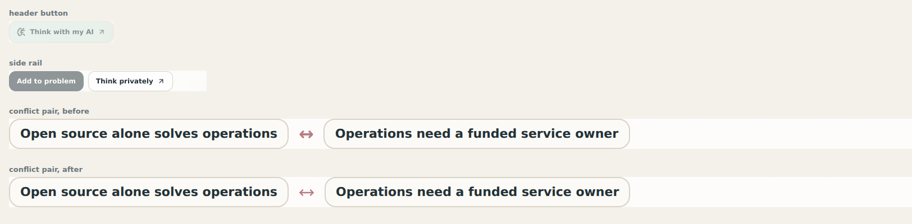

# Repos that already import an icon library

The second real repo, [br-ai-nstorm](https://github.com/blackmath88/br-ai-nstorm), is React and already renders `lucide-react` (7 icons, sizes 14–16). Next to those icons it also had Unicode glyphs, including a ↗ in the *same button* as `<BrainCircuit size={16} />`. There the right answer isn't a generated module. It's the library the repo already has: `<ArrowUpRight size={14} />`, with no path data copied. This slice teaches pikto that convention.

## 1. Audit precision: icon or typography
The first audit of br-ai-nstorm reported 23 "icon glyphs", but most were prose arrows: `${a} → ${b}` in timeline details, and "→ became a new intervention branch" in annotations. Acting on that list would turn text into icons, which is exactly the slop pikto exists to prevent. `glyphKind()` now separates the two:

| icon | typography |
|---|---|
| alone in its element or literal: `>↔<`, `'✓'` | between operands: `${a} → ${b}`, `a → b` |
| trailing a label as a marker: `Open source ↗</a>` | a separator literal: `' → '` |
| | leading a sentence: `→ became a new branch` |

Each typographic use says why (`why: "connector between operands"`).

| repo | before | after | dropped |
|---|---|---|---|
| br-ai-nstorm | 23 icons | 5 | 18, all prose arrows |
| opendata-explorer | 24 icons | 21 | 3, exactly the ones skipped by hand in [APPLY.md](APPLY.md) |

## 2. Libraries in `audit` and `profile`
`audit` inventories named imports from lucide(-react/-vue-next/-svelte), `@tabler/icons-react`, `@heroicons/react/24/*`, `@phosphor-icons/react`, `@radix-ui/react-icons` and `react-icons/{lu,fi,tb,pi,hi2}`. For each component it records the Iconify id it corresponds to, how often it's used, and the `size`/`strokeWidth` props. New issues:
- two icon families imported at once (two grammars in one UI)
- glyphs in files that already import a library ("use the library")

When a repo has no registry of its own, `profile` takes the library's grammar as the convention: family, grid, stroke width (from `strokeWidth` props, else the library default: lucide/tabler 2, heroicons outline 1.5), caps and joins, and render sizes from the `size` props. `search` then ranks that family first, and `sheet` measures candidates in it.

## 3. `apply` with a library target
When every chosen icon comes from the library's family, `apply` writes components instead of a module:
- **JSX text:** a glyph there becomes `<ArrowUpRight size={14} aria-hidden="true" />`.
- **Imports:** the component is merged into the existing import from the library, keeping its order convention (sorted stays sorted, appended otherwise). Otherwise a new import is added in the file's own semicolon style.
- **Everything else:** a glyph in a string, a template, or a non-JSX file is left for the agent, with a reason ("a string cannot hold a component").
- **Provenance** records the component, the package and its version range, and `operations: none`. No geometry is copied.

## First run: br-ai-nstorm
Profile: [profile-br-ai-nstorm.json](profile-br-ai-nstorm.json) · sheet: [sheet-br-ai-nstorm.html](sheet-br-ai-nstorm.html) · decision: [decision-br-ai-nstorm.json](decision-br-ai-nstorm.json) · patch: [br-ai-nstorm-icons.patch](br-ai-nstorm-icons.patch)

- **↗ → `ArrowUpRight` at 14px** on "Think with my AI" and "Think privately". It's a marker, so it's one size below the leading icon (16). The sheet flags it at 0.36× the weight of `brain-circuit`, which is intended for a trailing marker.
- **↔ in `.conflict-vs` → `MoveHorizontal`.** The first pick, `arrow-left-right`, was rejected on the rendered page: its two stacked opposing arrows read as *swap*, not tension. `move-horizontal` is the same single double-headed arrow ↔, drawn in lucide's grammar.
- **Left as they were:** the 18 prose arrows, and 2 glyphs in the static HTML prototype, which sits outside the React app.
- **Checks:** typecheck clean, 54/54 tests, `audit --check` shows no drift. The conflict pair was checked by server-rendering the real `StateView` with a fixture conflict (the seed data has none).

## Limits
- Only named imports are read. Per-icon deep imports (`lucide-react/dist/esm/icons/x`) and `unplugin-icons` (`~icons/lucide/x`) aren't yet.
- Component names come from the naming rule plus the set's canonical name. The installed package isn't checked for the export, so the target repo's typecheck is the proof (which is why the SKILL ends with it).
- `sheet` doesn't render the existing library icons as siblings automatically. The proposal has to list them (see the "existing: think with AI" item).
