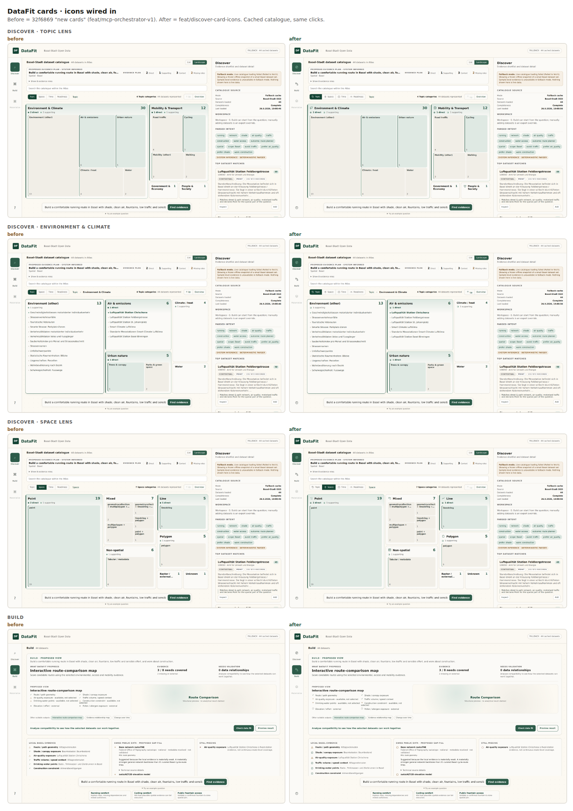

# Repos with their own hand-drawn icon set

Third case: opendata-explorer's card redesign (`32f6869`, "new cards") came with its own **59-icon set** in `src/ui/icons.ts`:
- hand-drawn on a 24 grid
- `icon(name, { size, label })`
- a catalogue plus tests: every icon catalogued, and no number above 24 in any fragment
- **the stroke lives on the `<svg>` wrapper** (`fill="none" stroke-width="1.5"`, round caps and joins), never on the shapes

That makes the repo's own set the grammar. #11's Phosphor fills would have been a second one, so #11–#13 were superseded.

## What pikto needed
- **`profile` reads the host wrapper.** For a registry, pikto parses the `<svg>` the icon function wraps fragments in. Its `fill`, `stroke`, `stroke-width` and caps/joins are inherited by every shape. Before this, the 105 bare stroke shapes counted as fills with no stroke width.
- **`adapt` writes to that convention.**
  - Stroke shapes come out bare: no `fill`, `stroke-width` or caps.
  - Fill shapes get `fill="currentColor" stroke="none"`.
  - A 2px Lucide or Tabler icon therefore lands as plain paths drawn at the set's 1.5 stroke.
- **`mask`, `strokePx`, `sheet` and `differ` render inside the host wrapper**, so weight and stroke are measured the way the app draws them.
- **`apply` has a registry mode.** `"call": "icon('$name', { size: $size })"` calls the repo's own function: nothing is generated, nothing is copied, and missing names are refused ("add it first").
- **`add` inserts into the repo's `ICONS` map**, keeping its style, and records provenance.

## What the checks caught
- **`differ` against the 56 existing icons.** The set is light and sparse, so the usual building-type icons came out 1.6–2.2× its weight: tram-front 1.74, building-2 2.21, landmark 1.71. They were replaced with train-front (1.49), tabler:building (1.51), tabler:users-group (1.11) and tabler:scale (1.39).
  - The scale is also the better metaphor: in this set, columns already mean *publisher source* (`prov-source`).
- **The repo's own test.** `lucide:leaf` has an arc radius of 25.9: a parameter, not a coordinate, but the set's rule is "every number within 24". Swapped to `tabler:leaf` (0.98×) rather than weakening the test.
- **The rendered page.** An icon in a small card's clamped title broke "Government" mid-word. Icons now show only where the title's longest word still fits beside them.

Sheet: [sheet-opendata-categories-cards.html](sheet-opendata-categories-cards.html) · decision: [decision-opendata-cards.json](decision-opendata-cards.json)

