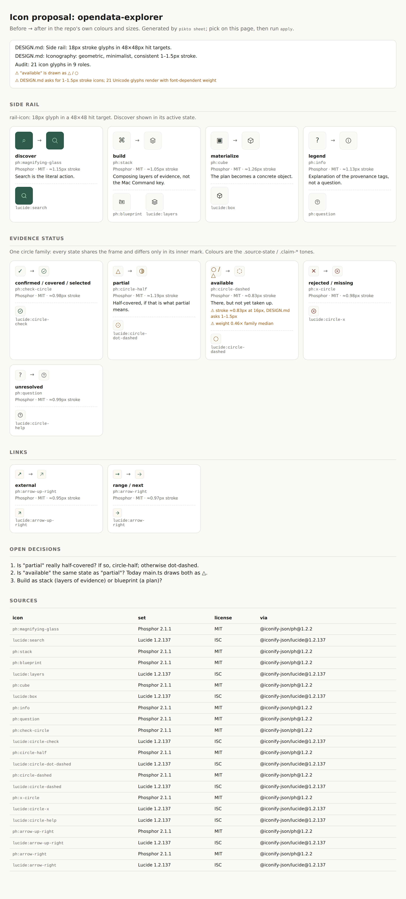

# pikto sheet

`pikto sheet <repo> --profile P --proposal F [--out sheet.html]` renders the contact sheet from [WORKFLOW.md](WORKFLOW.md) step 3: today's glyph → the proposed icon, per role family, in the repo's own colours and sizes. The human decides on this page, not in the JSON.

## Split of work
- **Agent (semantic):** writes `.pikto/proposal.json`. It lists the roles, the meaning each item stands for, the glyph used today, 1–3 candidate ids with the first one being the proposal, a one-line reading, and the render context (size, hit-target box, radius, colour and background as `var(--token)`). The agent also declares whether a role is meant to share a frame (`"frame": true`), and lists the questions only the human can answer.
- **Tool (deterministic):** adapts and validates every candidate, resolves `var()` against the repo's CSS and the DESIGN.md colours, measures each icon, compares the members of each family, and writes one self-contained HTML file (no JS, no external assets) plus a JSON report on stdout.

## What it measures
- **Optical stroke at the render size.** This works for any construction. Phosphor draws its "strokes" as filled outlines, so reading `stroke-width` isn't enough. The tool renders the icon and computes `2 · area / perimeter`, with the perimeter taken by Cauchy–Crofton (row and column transitions × π/4). Checked against known values: Phosphor Regular at 18px ≈ 1.125px, Lucide at 18px ≈ 1.5px. It flags anything more than 0.15px outside the DESIGN.md range.
- **Visual weight** of each member against the family median (flagged below 0.6× or above 1.6×).
- **Confusability inside the family.** When a role declares `"frame": true`, the frame is the ink a strict majority of members share, and only the *marks* (ink minus frame) are compared. The shared circle of a status family is intended, not a collision. Members that don't sit in the frame are flagged.

## First run: opendata-explorer
Proposal: [proposal-opendata-explorer.json](proposal-opendata-explorer.json) · sheet: [sheet-opendata-explorer.html](sheet-opendata-explorer.html)

- Phosphor Regular sits at ≈1.05–1.26px at 18px in the rail, inside the 1–1.5px DESIGN.md asks for. Lucide at the same size is ≈1.5–1.65px: at the top edge of the range, and visibly heavier next to Phosphor.
- The status family shares its circle (0.86 of median ink). The marks are distinct: the highest mark IoU is 0.14, for check vs x.
- **The finding:** `ph:circle-dashed` ("available") is 0.46× the family's weight, ≈0.83px at 16px. It will read as faint next to its siblings. Either accept that as the meaning ("there, but not taken up") or use `lucide:circle-dashed` / a heavier variant. That goes to the human.

## Limits
- Colour tokens are resolved from CSS custom properties and DESIGN.md `colors:`. Tailwind configs and CSS-in-JS aren't read.
- The render context is what the proposal says it is. The tool doesn't yet check it against the real CSS (e.g. `.rail-icon{font-size:18px}`).
