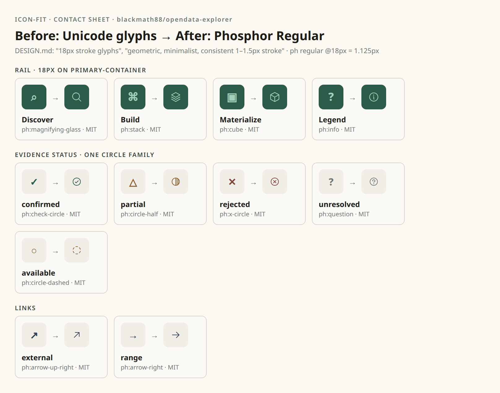

# How pikto works in practice: architecture and UX
Worked case: [blackmath88/opendata-explorer](https://github.com/blackmath88/opendata-explorer). The repo is finished, but its icons still need polish.

## What the repo is today
- **Intent** is already written down. `DESIGN.md` says: "Side rail: 18px stroke glyphs in 48×48px hit targets" and "Iconography: geometric, minimalist, consistent 1–1.5px stroke".
- **Reality** doesn't match that intent. There is no icon system. The repo uses about 23 Unicode glyphs inline in template strings (`main.ts`, `panels.ts`, `result.ts`):
  - **Rail:** `⌕` Discover, `⌘` Build, `▣` Materialize, `?` Legend.
  - **Status:** there are **three competing vocabularies**:
    - `result.ts`: ✓ △ ✕ ?
    - `panels.ts`: ✓ ○ ✕
    - `main.ts`: ✓ △ ×
  - **Links:** ↗ and →.
- **Problems:**
  - How the glyphs render depends on the font, and their weight changes with it.
  - `⌘` is the Mac Command key, not "Build".
  - "partial" and "available" share △ in one place and ○ in another.

So what's needed isn't more icons. It's **one small, coherent vocabulary that closes the gap between DESIGN.md and the code**.

## Architecture: 5 steps, 2 layers
```
          deterministic (CLI)                     semantic (LLM)
 1 audit   DESIGN.md + CSS + code → drift report
 2 read                                            group glyphs into roles, ask
                                                   "why this and not its peer?"
 3 propose search → adapt → differ → contact sheet  pick 1–2 candidates per role
 4 decide  ── human picks on the sheet ──
 5 apply   write src/ui/icons.ts, replace call sites, provenance, DESIGN.md ## Iconography
```
- **Intent vs. evidence.** `DESIGN.md` is the intent and the code is the evidence. The profile is only a derived cache (the point Scott raised on Syntax). Nothing new becomes a source of truth, except that the tool proposes an `## Iconography` section for DESIGN.md.
- **New command `audit`.** It finds:
  - icon-like Unicode glyphs, inline `<svg>` and icon-library imports
  - which **roles** they serve (by call-site context: `rail-icon`, `source-state`, `claim-*`)
  - inconsistent mappings (the same meaning with different glyphs, or the same glyph with different meanings)
- **Roles, not icons.** The unit of work is a *role family*, e.g. "evidence status × 5". A family shares one frame, here a circle, and differs only in its inner mark. That's Isotype's "works in a series", and the *différance* check (`differ`) runs inside the family: the members must be clearly distinguishable while sharing the same grammar.
- **Output fits the repo.** This is Vite + TS with template strings and no framework, so `add` writes an `icons.ts` module: `export const icon = (name, size=16) => '<svg …>'`. There's no React component and no new dependency. Colour comes from `currentColor`, so the existing `.source-state.ready/weak/missing` classes keep working unchanged.

## UX: where the human decides
1. **One command, one report.** `pikto audit ~/dev/opendata-explorer` → "23 glyphs, 3 roles, 3 inconsistencies, DESIGN.md asks for 1–1.5px stroke."
2. **The agent proposes a mapping**, not a design. The inconsistencies become explicit questions, e.g. "Is 'available' the same state as 'partial'?"
3. **A contact sheet** (screenshot below) shows *before → after* in the repo's own colours, sizes and containers (rail 18px on `primary-container`, status in the warn/danger tones), with source and license under each tile. This is where the human decides, not in the JSON.
4. **The apply step is a reviewable diff**: `icons.ts`, the replaced call sites, `.pikto/provenance.json` (with the reading and permission for each role), and the DESIGN.md addition.
5. **Re-running `audit`** reports only drift, e.g. a new Unicode glyph in a PR. This could also be a pre-commit or CI check.



## The proposal for this repo (first pass)
| Role | Today | Proposal | Reasoning |
|---|---|---|---|
| Discover | ⌕ | ph:magnifying-glass | Search is the literal action. |
| Build | ⌘ | ph:stack | Composing *layers* of evidence, instead of the Mac key. |
| Materialize | ▣ | ph:cube | Turning the plan into a concrete object. |
| Legend | ? | ph:info | Explanation, not a question. |
| confirmed / partial / rejected / unresolved / available | ✓ △ ✕ ? ○ (inconsistent) | check-circle / circle-half / x-circle / question / circle-dashed | One circle family. Each state differs only by its inner mark. "available" becomes dashed: it's there but not yet taken up. |
| external / range | ↗ → | arrow-up-right / arrow-right | Same stroke as everything else. |

Everything comes from Phosphor Regular (MIT). At 18px its stroke is 1.125px, which is inside the "1–1.5px" DESIGN.md asks for.

**Open decisions for the human:**
- Is "partial" really half-covered? If so, `circle-half`.
- Build as `stack` or as `blueprint`?
